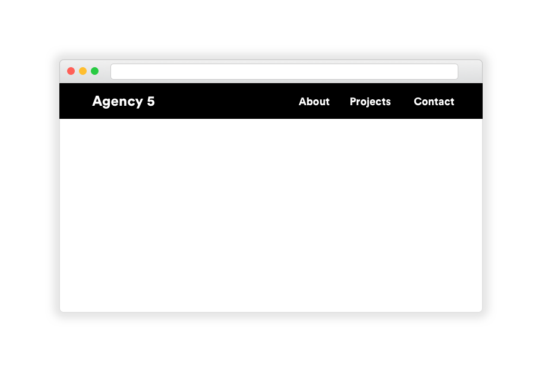

# Build a Header Navigation Bar

Using HTML and CSS, build out the navigation bar in the provided mock-up.

## Prerequisites

* Semantic HTML
* Including an external CSS file
* Writing styling rules in CSS

## Instructions

1. Fork and clone this repository.
1. Change into the new directory.
1. Fulfill the listed requirements.

Starter code is available in [`lib/`](lib/). You are not required to turn in
your submission.

## Requirements

The image above is a mock-up, an image of a website that a designer would give
to a developer to show how a website should be built and styled. When we get
a mock-up from a designer, our job is to break it up into different parts and
translate the design, first into HTML, then into CSS.

### Part 1: Structure

#### Wireframe the Mock

On the whiteboard, create a wireframe for the mock-up.

#### Outline our Wireframe

Once you have the wireframe, what HTML elements should you use for the different
parts of your wireframe?

#### Wireframe to HTML

Create an `index.html` file in the `lib/` directory and open it in VS Code. Work
through the following steps:

1. Build out the HTML skeleton described in class
1. Inside the `body` tag, build out the navigation bar that you wireframed and
   outlined on the whiteboard.

### Part 2: Styling

Let's first create a CSS file inside the `lib/` directory and include it inside
the `index.html` file we created for Part 1.

#### `body`

Give the `body` a margin of 0 and set the font to be a sans-serif font.

#### `header`

Give the `header` element a black background. Add 20px of padding to the
`header`.

#### `h1`

Make the `h1` text white.

#### `nav`

Position the `nav` to the right.

#### `ul` and `li`

Make it so the `li`s all appear in a single line. Format the text inside of the
`li`s to look like the links in the nav

## Bonus: Add a `.wrapper` class

If you expand and contract the width of your browser, you'll notice that the
title and navigation list can become really spread out. There's a really common
pattern for solving this, and that's adding an element with a class of
`.wrapper` around the contents of our `header`.

1. Add a `div` with a class of `.wrapper` around the contents of your `header`
1. Add a rule in your CSS file selecting your `.wrapper` element
1. Give the `.wrapper` element a width of 90% and a maximum width of `800px`.
1. Set the margin on `.wrapper` to be `auto` on the left and right.

What happens when you make your browser window really wide now?

## Bonus: Naming CSS classes

Knowing what to name your CSS classes is tricky. You want something memorable
and semantic, but you also don't want to waste a lot of time coming up with
names for things. Because this is such a common problem, developers have come up
with conventions for how they name their CSS classes. One of the best and most
used conventions is called **BEM**, which stands for block, element, modifier.

Read the following two blog posts about BEM and then update your header and
navigation to use the BEM syntax.

1. [MindBEMding – getting your head 'round BEM syntax](https://csswizardry.com/2013/01/mindbemding-getting-your-head-round-bem-syntax/)
1. [BEM 101](https://css-tricks.com/bem-101/)

## [License](LICENSE)

1.  All content is licensed under a CC­BY­NC­SA 4.0 license.
1.  All software code is licensed under GNU GPLv3. For commercial use or
    alternative licensing, please contact legal@ga.co.
